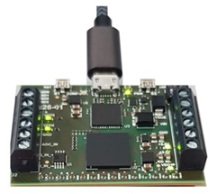

# MAX10 Power Sequencer (Trenz TEI0026) 

## Features

- 1 clock 12 MHz
- 7 leds
- 4 switch
- 1 user button
- 2 GPIOS
- Programmer FT2232H 
- UART Serial Rx/Tx through USB (FT2232H)
- 1 ADC input
- 1 differential current input
  - [Analog DevicesAD8417BRMZ-RL](https://octopart.com/ad8417brmz-rl-analog+devices-24150874?r=sp) SP Amp Current Sense Amp Single ±2.75V/5.5V 8-Pin MSOP T/R
- 3 regulable output voltages (VDD1/2/3)
  - VDD1 Intel / Altera EP53A7LQI Conv DC-DC 2.4V to 5.5V Step Down Single-Out 0.6V to 5V 1A 16-Pin QFN T/R
  - VDD2 Intel / Altera EP53A7HQI Conv DC-DC 2.4V to 5.5V Step Down Single-Out 1.8V to 3.3V 1A 16-Pin QFN T/R
  - VDD3 Intel / Altera EP5388QI  Conv DC-DC 2.4V to 5.5V Step Down Single-Out 0.6V to 5V 0.8A 16-Pin QFN