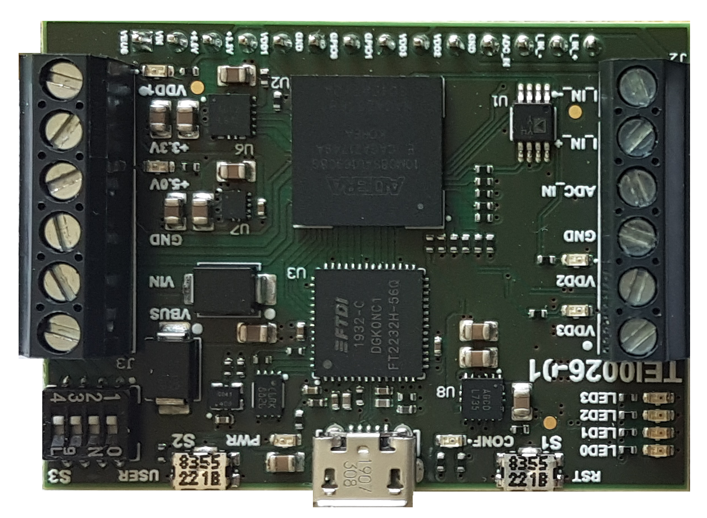

# Trenz TEI0026-01 Enpirion Power Board (MAX10 Power Sequencer )

MAX10 Power Sequencer: Control 4 voltage rails via USB/PC and adjust on the fly from 0.8V to 3.3V, with up to 1A per rail. Perfect full automated voltage systems or laboratory, sequenced by MAX10. Includes a full PC controlled power demo, to Jump Start the board.

I got one of them as a free of charge Arrow promotion board in the European "JUMP START" Program for FPGAs.

I requested documentation to both Trenz electronics and Arrow Europe. Both of them replied with the documentation found in this repo.

After requesting documentation for this board, Arrow  published this repository https://github.com/ArrowElectronics/tei0026-01. Names this board as "Trenz TEI0026-01 Enpirion Power Board" and indicates that the Enpirion product line has been discontinued. 

## Features

- Altera MAX10 8kLE FPGA (10M08SAU169C8G) (same FPGA as [MAX1000](https://github.com/SoCFPGA-learning/Max1000))
  - Total logic elements  8,064
  - Total registers	105
  - Total memory bits	387,072 (48 kB) [42 M9k]
  - Embedded Multiplier 9-bit elements	48 
  - Total PLLs	1
  - UFM blocks  1
  - ADC blocks  1

- 1 clock at 12 MHz
- 7 user leds
- 4 DIP switches
- 1 user button
- 2 GPIOS
- Programmer FTDI FT2232H-56Q  (USB to JTAG)
- UART Serial Rx/Tx through USB (FT2232H)
- 1 ADC input (3V at 5.5V)
- 1 Current sense amplifier
  - Analog DevicesAD8417BRMZ-RL SP Amp Current Sense Amp Single ±2.75V/5.5V 8-Pin MSOP T/R
- Voltage input pin (VIN)  at 5 V
- Voltage output pins (3.3V, 5V, USB_VBUS)
  - 3V3 Intel / Altera  EP5348UI Conv DC-DC 2.5V to 5.5V Step Down Single-Out 0.6V 0.4A 
- 3 regulable output voltages (VDD1/2/3)
  - VDD1 Intel / Altera EP53A7LQI Conv DC-DC 2.4V to 5.5V Step Down Single-Out 0.6V to 5V 1A 
  - VDD2 Intel / Altera EP53A7HQI Conv DC-DC 2.4V to 5.5V Step Down Single-Out 1.8V to 3.3V 1A 
  - VDD3 Intel / Altera EP5388QI  Conv DC-DC 2.4V to 5.5V Step Down Single-Out 0.6V to 5V 0.8A 

